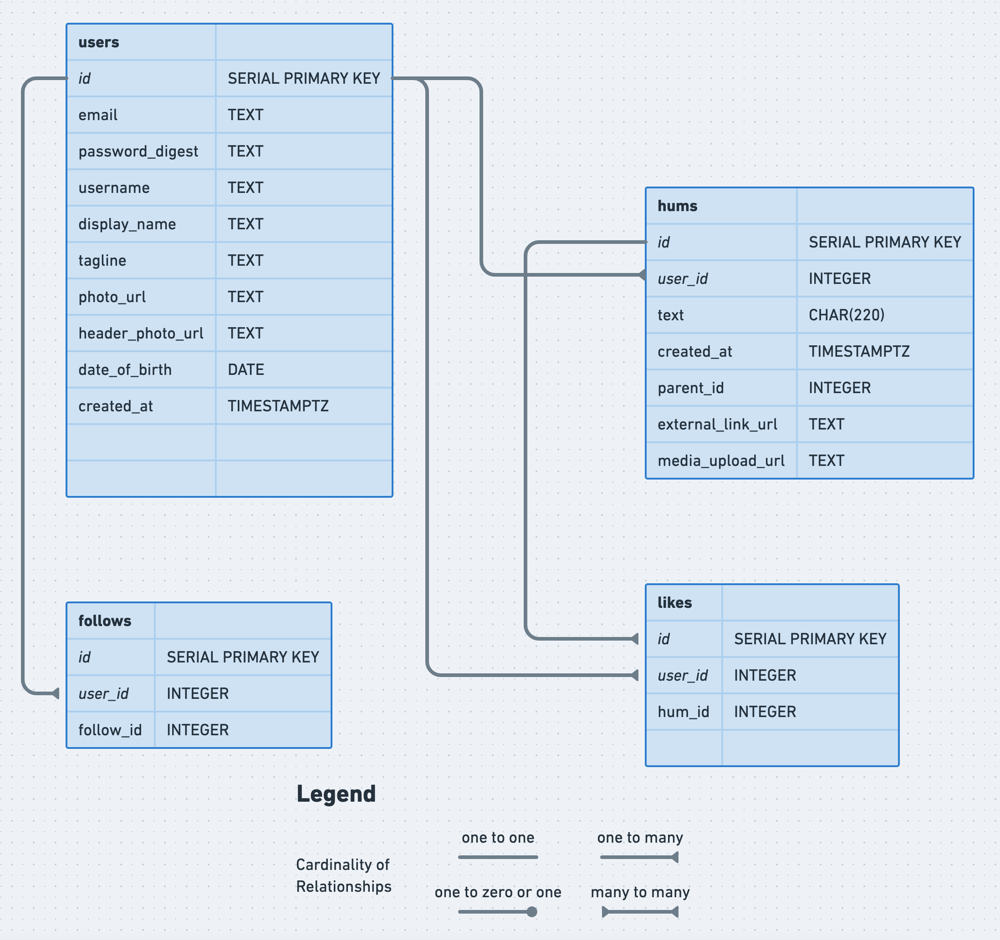

# Hummer Social app

[Visit website](https://hummer-social.herokuapp.com/)

Version: Prototype - first deployed 11 June 2021 on Heroku platform.

### Purpose
The purpose of this web application is for users to microblog and participate in a social network. The app is inspired by Twitter. 

Features include:
- Sign in / log in functionality
- User can create profile, including bio and profile pic.
- Add post (hum), read posts.
- Browser other user profiles.
- Displays age of post (hum).
- Follow, unfollow.
- Like, unlike.
- RESTful routes
- 4 resource tables using a PSQL database

## Techniques
Demonstration of a simple CRUD web app, using Ruby and SQL, and deploying to an external server. Utilised Cloudinary image upload server Ruby gem. Also while continuuing to utilise javaScript, basic HTML and basic CSS.

### Known issues/bugs
- UI is only optimised for desktop view, mobile device untested.

### Backlog user stories( to-do and wishlist)
- User wants to see posts liked by users followed
- User wants to reply
- User wants to retweet
- User wants to upload a picture in a post
- User wants to add a link that gets highlighted in post

### Schema
